# Canonical Build and Content Flow

Status: resolved beginning with the 0.15.3 background-detail release and retained
by the 0.15.4 background-life iteration. This file is
the authority for Chapter 1 source ownership, generation, packaging, runtime
resolution, evidence, and release gates.

## One source-to-frame path

```mermaid
flowchart LR
    A["art_source/chapter1_location_locked/source_panels"] --> B["tools/build_chapter1_location_art.py"]
    C["data/chapter1_location_lock.json"] --> B
    D["data/gameplay.json"] --> B
    B --> E["assets/stage/chapter1_location_locked"]
    B --> F["data/stage_chunks.json"]
    B --> G["data/chapter1_art_build.json hash receipt"]
    E --> H["tools/build_content_release.py --strict"]
    F --> H
    G --> H
    I["assets/sprites + props + audio"] --> H
    J["data/atmosphere.json + gameplay/content definitions"] --> H
    H --> K["one deterministic content pack"]
    H --> L["byte-identical PC and Android manifests"]
    H --> M["platform build_provenance.json"]
    K --> N["tools/Build-Windows.ps1 / PyInstaller"]
    K --> O["android/buildozer.spec / pinned python-for-android"]
    L --> N
    L --> O
    M --> N
    M --> O
    N --> P["validated Windows onedir and Desktop package"]
    O --> Q["validated Android APK"]
    P --> R["src/config.py selects one complete resource root"]
    Q --> R
    R --> S["gameplay level ID -> location route"]
    S --> T["pixel_art._draw_location_locked_background"]
    T --> U["backdrop.render_route_backdrop"]
    U --> V["authored panorama + haze/skyline/ground/near layers"]
    V --> W["PC or Android frame + runtime provenance log/overlay"]
```

There is no directory scan or best-match scene lookup. `data/gameplay.json`
selects one unique level ID; `data/chapter1_location_lock.json` maps that ID to
one route; every route names every active file. `src/config.py` selects one
complete root for the process and never combines files from multiple roots.

## Source-of-truth ownership

| Concern | Canonical authority |
|---|---|
| Character and boss pixels | `assets/sprites/**` |
| Animation clips and timing | `src/animation_manifest.py`; generated atlas pixels remain in `assets/sprites/**` |
| Combat/effects rules | `data/gameplay.json`, `src/entities.py`, `src/game.py`, `src/pixel_art.py` |
| Chapter scenery source | `art_source/chapter1_location_locked/source_panels/**` and calibration inputs |
| Chapter scenery runtime files | Manifest-declared files under `assets/stage/chapter1_location_locked/**` |
| Route geography/parallax/physical vehicles | `data/chapter1_location_lock.json` |
| Level IDs, encounters, rails, props | `data/gameplay.json` |
| Narrative/environment event contract | `data/chapter_content.json` |
| Sky and atmosphere motion | `data/atmosphere.json` |
| Generated chunk compatibility | `data/stage_chunks.json` plus `assets/stage/chapter1_location_locked/chunks/**` |
| Generated-file identity | `data/chapter1_art_build.json` |
| Shared PC/Android package identity | `tools/build_content_release.py` output |
| App/content compatibility version | `src/version.py` |

## Complete path classification

No audited path remains `UNKNOWN`.

| Path or system | Classification | Active role |
|---|---|---|
| `art_source/chapter1_location_locked/source_panels/**` | CANONICAL | Detailed route painting inputs. Never loaded directly by the game. |
| `art_source/chapter1_location_locked/calibration/**` | CANONICAL | Orthographic ground/projection generator input. |
| `art_source/chapter1_location_locked/props/**` | LEGACY SOURCE | Preserved vehicle source material; not searched at runtime. |
| `assets/stage/chapter1_location_locked/ch1_l*_main_v2.png` | GENERATED, CANONICAL RUNTIME | Detailed opaque one-to-one world panoramas. |
| Other `ch1_l*_*_v2.png` in that directory | GENERATED, CANONICAL RUNTIME | Transparent haze, skyline, ground, far, near, and occluder layers. |
| `assets/stage/chapter1_location_locked/chunks/**` | GENERATED, CANONICAL COMPATIBILITY | Culling/foreground chunk records; cannot replace the authored panorama. |
| `assets/stage/chapter1_location_locked/source_concepts/**` | TEST-ONLY REFERENCE | Review reference; no runtime reference. |
| `assets/stage/second_street_*.png` | LEGACY | Explicit legacy stage, epilogue, or historical tests only; never a Chapter 1 fallback. |
| `assets/sprites/**` | CANONICAL | Runtime actor/animation atlases and fist metadata. |
| `assets/reference/**` | GENERATED INPUT / TEST-ONLY | Atlas generation and visual-contract tests; not direct gameplay frames. |
| `assets/props/vehicles/**` | CANONICAL | Two sedan bodies; manifest paint/condition/accessory/facing fields create four deterministic route variants. |
| `assets/portraits/**`, `assets/audio/**`, root key art | CANONICAL | UI/audio assets named exactly by gameplay or code. |
| `data/gameplay.json` | CANONICAL | Sole playable level/geometry/gameplay definition. Duplicate IDs fail packaging. |
| `data/chapter1_location_lock.json` | CANONICAL | Sole Chapter 1 scene/asset/route definition. |
| `data/chapter_content.json` | CANONICAL | Chapter narrative and authored environment contract. |
| `data/atmosphere.json` | CANONICAL | Shared route atmosphere definitions. |
| `data/stage_chunks.json` | GENERATED | Chunk compatibility manifest; receipt-hash checked. |
| `data/chapter1_art_build.json` | GENERATED | Exact input/output hashes; stale outputs fail strict packaging. |
| `data/content-manifest.json` | GENERATED EMBED | Replaced by the current deterministic manifest during each package build. |
| `src/backdrop.py` | CANONICAL RENDERER | Composes the authored main, transparent depth layers, dynamic atmosphere, and bounded cache. |
| `src/pixel_art.py` strict Chapter 1 route | CANONICAL RENDER DISPATCH | Only active Chapter 1 background and foreground dispatch. Missing art raises an error. |
| `src/stage_world.py` | GENERATED COMPATIBILITY | Reads manifest chunks for culling/near foreground; no longer selects the broad background architecture. |
| `legacy_second_street` procedural branch in `src/pixel_art.py` | LEGACY | Explicit non-campaign theme only. Unknown campaign themes fail. |
| Procedural actor frames and sunset fallback | FALLBACK | Direct-module safety/legacy epilogue only; runtime provenance for Chapter 1 must remain false. |
| In-memory Pygame atlas/backdrop LRUs | GENERATED CACHE | Process-local optimization, surfaced as `cached_asset_used`; never disk authority. |
| `tools/build_chapter1_location_art.py` | CANONICAL GENERATOR | Rebuilds every route/layer/chunk and writes the hash receipt. |
| `tools/build_animation_library.py`, `tools/build_sprite_atlas.py` | CANONICAL GENERATORS | Atlas generation; generated atlases are committed runtime assets. |
| `tools/build_content_release.py` | CANONICAL CROSS-PLATFORM BUILD | Strict validation, deterministic ZIP, identical manifests, provenance. |
| `tools/Build-Windows.ps1` | CANONICAL PC BUILD | Tests, visual gate, PyInstaller, exact package launch, Desktop install/hash check. |
| `android/buildozer.spec` | CANONICAL ANDROID BUILD | Includes the same source assets/data/manifest/provenance with pinned p4a commit. |
| `.github/workflows/windows-desktop-release.yml` | CANONICAL PC RELEASE | Builds and attaches the complete Windows ZIP plus content/provenance. |
| `.github/workflows/android-apk-release.yml` | CANONICAL ANDROID RELEASE | Runs the same source gate, builds APK, attaches APK/content/provenance. |
| `main.py`, `src/main.py` | CANONICAL LAUNCH | Source/package entry points. |
| `Run Foundation Self-Test.cmd` | TEST-ONLY LAUNCH | Hardware-free package/source verification. |
| `Convert Music to 8-Bit.cmd`, conversion scripts | TOOL-ONLY | Audio authoring; not game launch. |
| `Open Crash Logs.cmd` | TOOL-ONLY | Opens runtime logs; no content authority. |
| `dist/The Fades of Fate/**` | GENERATED EXECUTABLE OUTPUT | Validated Windows staging package. Never edited as source. |
| `C:/Users/blowb/Desktop/The Fades of Fate Demo/**` | GENERATED INSTALLED OUTPUT | Complete validated onedir copy and shortcut target. Never edited as source. |
| `android/bin/*.apk` | GENERATED EXECUTABLE OUTPUT | Android artifact. Never reused under another version. |
| `build/**`, `dist/content/**`, `visual_overhaul/**` | GENERATED EVIDENCE/OUTPUT | Reports, captures, manifests, packs. No runtime source lookup. |
| `.venv/**`, `__pycache__/**`, `.pytest_cache/**`, `.mypy_cache/**` | GENERATED CACHE | Local tooling only. |
| `android/.buildozer/**`, `android/.gradle/**`, `.buildozer/**` | GENERATED CACHE | Android build intermediates only. |
| `logs/**`, Android private logs | GENERATED RUNTIME OUTPUT | Breadcrumbs, resolved paths/hashes, crashes. |
| Default user content-update directory | GENERATED UPDATE ROOT | Inactive unless updater validation succeeds; then selected as one complete root, never mixed per file. |

## Proven visual regression

The detailed art was present; it was not selected by the compositor. Commit
`d8bca2b1ed2cbfa1d5e42ecfd11ff9329e749eea` added the layered-route branch in
`src/backdrop.py`. When both `architecture` and `ground` existed, that branch:

1. skipped `main_panorama_asset`;
2. drew a synthetic sky;
3. drew the generated low-detail architecture and ground over it.

`src/pixel_art.py` later routed Chapter 1 directly through `StageWorld`, which
made the same flat chunk architecture authoritative and returned before the
existing ambient/world-light passes. Asset presence, version strings, and old
self-test screenshots could not detect that selection error.

The correction makes a manifest-declared main panorama authoritative even when
generated layers exist, keys caches by panorama path/mode, restores transparent
far/mid/world atmosphere and lighting, and retains generated ground/near layers.
The global floating landmark-label pass was removed; only facade-anchored signs
remain. Parked cars use a `0.72` far-apron visual scale and four nonrepeating
route variants.

## Runtime provenance and root selection

At each level load, `src/game.py` logs the resolved scene path/hash and every
active scenery path/hash. F3 displays game/content commits, manifest hash,
timestamp, platform, level, exact scene path, renderer, active root, layer and
animation counts, vehicle variants, fallback/cache state, and artifact match.

`src/config.py` permits exactly one root per process:

1. a user/update root only after every manifest file passes path, size, and
   SHA-256 validation;
2. otherwise the complete executable root;
3. otherwise the bundled extraction root.

A missing file fails. Resolution never continues into another root.

## Refuse-to-release gates

`tools/build_content_release.py --strict` fails on duplicate/different level
IDs, noncanonical active scenery, missing assets, active fallback declarations,
repeated route vehicles, stale generator hashes, malformed chunks, or manifest/
pack drift. It emits one deterministic pack and byte-identical PC/Android
manifests.

`tools/validate_visual_acceptance.py` emits explicit PASS/FAIL for all required
visual criteria. `tools/Build-Windows.ps1` then launches the exact onedir,
requires `artifact_match=true`, runs the complete self-test, checks package and
installed hashes, and refuses completion on any failed acceptance item. The
Android workflow runs the same source/content gate before its pinned build;
installed APK screenshots, video, and logs remain required release evidence.
